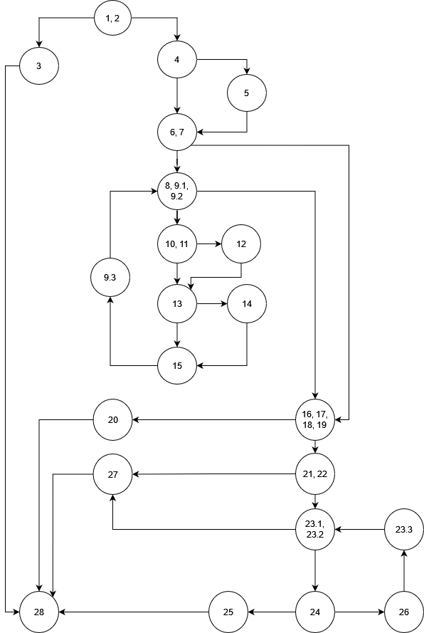
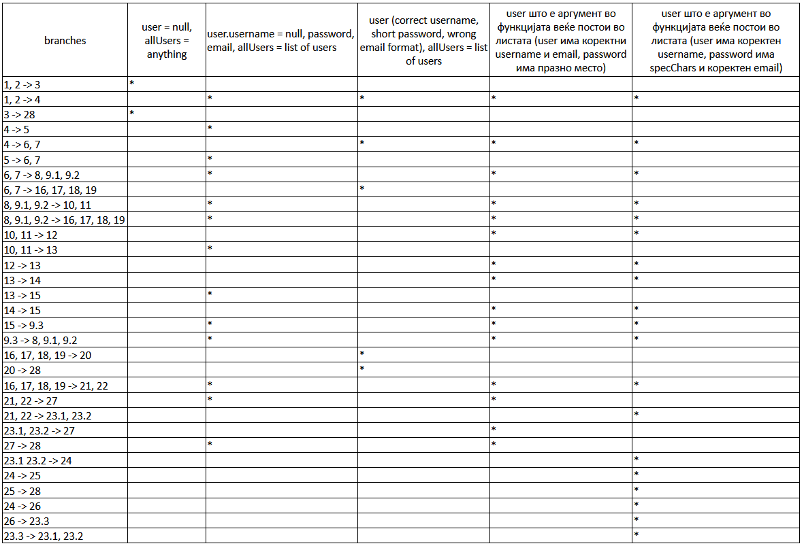

## Kire Atanaskov, 213132

### 2. За дадениот код во функцијата function нацртајте Control Flow Graph со некоја алатка за цртање дијаграми. Внесете го нацртанот CFG во документацијата.

### 3. Пресметајте ја цикломатската комплексност на дадениот код. Објаснете како стигнавте до резултатот.
Цикломатската коплексност на графот е 11.

Според региони:  
графот има 10 опкружени региони и 1 од надвор, вкупно 11.   
Според број на предикатни јазли:  
Графот има 10 предикатни јазли, на тој број се додава +1 и се добива 11 за цикломатската комплексност.  
Според број на јазли и ребра:  
V = E(edges) - N(nodes) + 2  
V = 31 - 22 + 2 = 11  

### 4. Напишете ги сите тест случаи според Every Branch критериумот. Напишете и објаснете ги тест случаите во документацијата.  
  
Прв тест случај:  
За user имаме null, програмата ќе влезе во првиот if statement каде што проверува дали user е null или  
user.getPassword() е null или user.getEmail() е null. Ќе фрли исклучок и ќе заврши програмата. Не е важно што имаме зa  
allUsers бидејќи не влијае никако на резултатот од овој тест.

Втор тест случај:  
Username за user e null, password и email се коректни, allUsers е листа со корисници. Програмата ќе ги повика  
getEmail и setUsername фукнциите од класата User(означено со број 5 на графот). Од број 7 ќе продолжи на број 8,  
ќе влезе во for циклусот, но не ги извршува деловите означени со 12 и 14 (претпоставка дека во листата allUsers нема  
user со исти податоци како тој што се предава како аргумент на функцијата). Пасвордот содржи празно место, па програмата  
преминува на линијата означена со 27 (return false) и на крај завршува во терминалниот јазел.

Трет тест случај:  
Форматот за Email адресата не е во ред, па програмата не го исполнува условот за да влезе во if означен со број 7,  
па од таму продолжува на лините означени со 16, 17, 18, 19. Бидејќи во 19 не е исполнет условот (должината на пасвордот  
е помала од 8) програмата преминува на линија 20 (return false) и на крај оди во терминалниот јазел означен со 28.  

Четврт тест случај:  
Во листата веќе постои user со исти податоци како тој што се предава како аргумент на функцијата. Програмата влегува во  
for циклусот означен со број 9 и соодветно го поминува сите редови во for циклусот. На крај доаѓа до линија 22 и бидејќи  
пасвородот содржи празно место, преминува на линија 27 (return false) и на крај во терминалниот јазел 28.

Петти тест случај:  
Во листата веќе постои user со исти податоци како тој што се предава како аргумент на функцијата и сите податоци за user  
се коректни. Програмата влегува во for циклусот означен со број 9 и соодветно го поминува сите редови во for циклусот.  
Доаѓа до if (19), влегува во else делот и проверува дали пасвордот содржи празно место (21, 22). Ги изминува сите линии  
во for циклусот и кога ќе најде специјален карактер во пасвордот оди во 25 (return same == 0) и потоа во терминалниот јазел(28).  
### 5. Напишете ги сите тест случаи според Multiple Condition критериумот за условот иф (user==null || user.getPassword()==null || user.getEmail()==null). Напишете и објаснете ги тест случаите во документацијата.  
Прв тест случај:  
user e null (со самото тоа значи дека и другите да услови се исполнети). Програмата фрла исклучок.  
  
Втор тест случај:  
Само user.getPassword() е null. Програмата фрла исклучок.  
  
Трет тест случај:  
Само user.getEmail() e null. Програмата фрла исклучок.  
  
Четврт тест случај:  
user.getPassword() и user.getEmail() се null. Програмата фрла исклучок.  

### 6. 